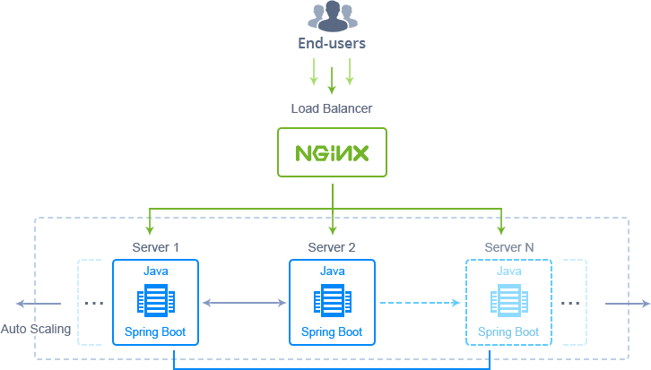
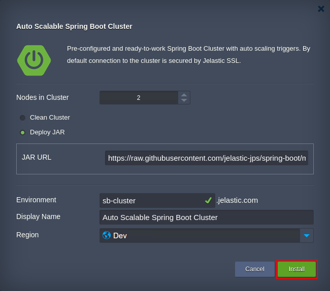

# Auto-Scalable Spring Boot Cluster 

Reliable [Spring Boot](https://projects.spring.io/spring-boot/) Сluster with preconfigured alerts on high load and smart auto-scaling configurations.

## Spring Boot Cluster Topology

During installation, you define a number of Spring Boot application servers in the cluster (up to 10 instances), which will be automatically [scaled in/out](https://docs.jelastic.com/automatic-horizontal-scaling) in order to handle the dynamically changing amount of incoming traffic. 

The current Spring Boot solution is implemented using the following software stacks:
- *Load balancer* (LB) - dockerized template with **_NGINX 1.10.1_**
- *Application server* (AS) - native template with **_Spring Boot 1.5.2_** on top of **_Java 8_** 

Herewith, each LB and AS container has the default [vertical scaling](https://docs.jelastic.com/automatic-vertical-scaling) limit up to **16 cloudlets** (equals to 2 GiB of RAM and 6.4 GHz of CPU per node) and a set of [load alerts](https://docs.jelastic.com/load-alerts) (to notify you when resource consumption comes close to instance threshold). In addition, connection to the cluster is secured with [Jelastic SSL](https://docs.jelastic.com/jelastic-ssl).

Subsequently, any of these default settings can be adjusted - refer to the appropriate above-linked guides for the details.

## Auto-Scaling Configuration

The Spring Boot Cluster package automatically adjusts the number of application servers based on the consumption of resources as follows:
- +1 node if RAM/CPU usage is >70% for at least 5 minutes (up to 10 instances)
- -1 node if RAM/CPU usage is <40% for at least 5 minutes (but not less than a number of servers specified during installation)

The appropriate modifications are automatically applied to add or remove Spring Boot nodes, whilst you receive an email message about the corresponding scaling operation.    

In case you’d like to change the conditions of automatic scaling, adjust the appropriate triggers by following the [Automatic Horizontal Scaling](https://docs.jelastic.com/automatic-horizontal-scaling) guide.

## How to Install Auto-Scalable Spring Boot Cluster

The Spring Boot Cluster package deployment is completely automated and available for everyone:
- if having no Jelastic account yet, click **Deploy to Jelastic** to register for a trial period and install the package

   

- if you are already registered, log in to the Jelastic dashboard and [import](https://docs.jelastic.com/environment-import) a link to the [**_manifest.jps_**](https://github.com/jelastic-jps/spring-boot/blob/master/manifest.jps) file from the current repository

   

Fill in the installation form with the following data: 
- **_Nodes in Cluster_** - number of application servers your cluster should include
- choose deployment type:
   - **_Clean Cluster_** - to create a bare cluster with no application inside
   - **_Deploy JAR_** - to deploy *JAR* application from the linked repo (where the default project is a message repository)

Type *Environment* name and, optionally, *Display Name* ([alias](https://docs.jelastic.com/environment-aliases)). Also, select the preferable [region](https://docs.jelastic.com/environment-regions) (if several ones are available) and click **Install**.

Wait a few minutes for Jelastic to prepare environment and configure the auto-scaling settings. 

For more information on working with Spring Boot in Jelastic Cloud, refer to the following [article](http://blog.jelastic.com/2017/04/27/hosting-spring-boot-java-applications/).
